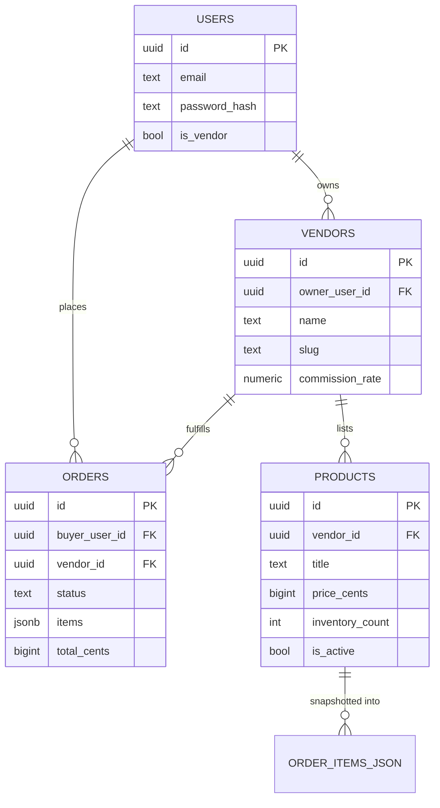
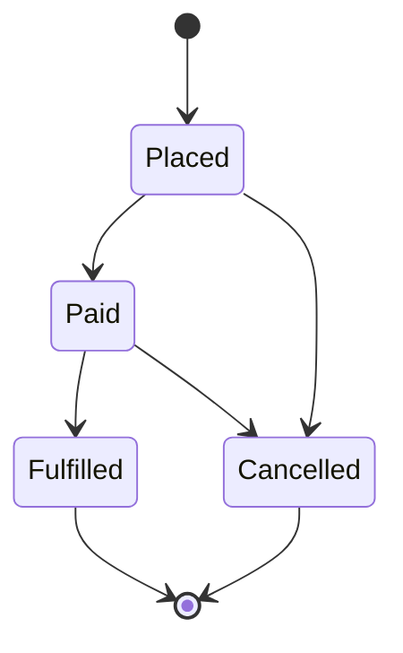

# Architecture

Companion to the README (setup + endpoint reference). This covers *why*
the code is shaped the way it is, so you can extend it without breaking
the invariants it relies on.

## Crate boundaries and why they exist

```
domain   <-- no dependencies on db or api. Pure types + business rules.
  ^
  |
  db     <-- depends on domain + sqlx. Talks to Postgres.
  ^
  |
  api    <-- depends on domain + db + axum. HTTP only.
```

The rule: **domain never depends on db or api.** If you find yourself
importing `sqlx` types into `domain/src/lib.rs`, stop — that logic
belongs in `db`. This boundary is what makes `OrderStatus::can_transition_to`
testable with zero database in a plain `#[test]`, and it's what would let
you swap Postgres for something else later without touching business rules.

`api` never talks to the database directly — every query goes through a
`db::` function. Handlers only orchestrate: extract input, call `db`,
map errors, return JSON.

## Request lifecycle (authenticated request)

```mermaid
sequenceDiagram
    participant Client
    participant Axum as Axum Router
    participant Claims as Claims extractor
    participant Handler
    participant DB as db crate
    participant PG as Postgres

    Client->>Axum: POST /orders (Bearer token)
    Axum->>Claims: FromRequestParts::from_request_parts
    Claims->>Claims: verify JWT signature + expiry
    Claims-->>Handler: Claims { sub, is_vendor, exp }
    Handler->>DB: place_single_vendor_order(...)
    DB->>PG: BEGIN; SELECT ... FOR UPDATE; UPDATE inventory; INSERT order; COMMIT
    PG-->>DB: Order row
    DB-->>Handler: Result<Order>
    Handler-->>Client: 200 Json(Order) or ApiError response
```

The `Claims` extractor runs **before** your handler body executes — if
the token is missing or invalid, the handler never runs at all. This is
why handlers that need auth just take `claims: Claims` as a parameter;
there's no `if !authenticated { return 401 }` boilerplate anywhere.

## Data model



**Why `orders.items` is JSONB, not a normal `order_items` table:** an
order is a point-in-time snapshot of what was bought and at what price.
If a vendor edits a product's title or price next week, past orders must
still show what the buyer actually saw and paid — a foreign key to
`products` would let that history silently change. The tradeoff: you
can't run SQL aggregates across order items directly (e.g. "top-selling
product this month") without parsing JSON. If that reporting need shows
up, add a proper `order_items` table written at order-creation time
*in addition to* the JSON snapshot, rather than replacing it.

## The order state machine

`OrderStatus::can_transition_to` (in `domain`) is the single source of
truth for which transitions are legal:



`db::update_order_status` calls this function before writing anything —
an attempt to go `Fulfilled -> Placed`, for example, is rejected with an
error before it ever reaches SQL. If you add a new status (e.g.
`Refunded`), you only need to update this one match expression; every
caller automatically inherits the new rule.

## The v1 constraint that shapes everything: one vendor per order

This was a deliberate scope cut, not an oversight. It's enforced in
exactly one place — `db::place_single_vendor_order` — which locks each
product row (`SELECT ... FOR UPDATE`), tracks the vendor of the first
item, and rejects the whole transaction if a later item belongs to a
different vendor. Locking happens before the vendor check so concurrent
checkouts against the same product can't both succeed against stale
inventory counts.

**When you're ready to remove this constraint** (multi-vendor carts +
split payments), expect to touch:
- `domain::Order` — `vendor_id: VendorId` becomes per-`OrderItem`, not per-`Order`
- `db::place_single_vendor_order` — becomes a loop that opens one Stripe
  charge/transfer per vendor instead of one order row
- The `orders` table — `vendor_id` column moves to a new `order_items`
  table (at which point the JSONB snapshot above may become that table)
- Order status — becomes per-line-item (vendor A ships while vendor B is
  still processing), so `OrderStatus` moves from `Order` to `OrderItem`

Doing this now, before the single-vendor flow has been run for real,
means guessing at the schema. Doing it after means you'll know exactly
which of the above actually matters for your use case.

## Error handling

Every handler returns `Result<T, ApiError>`. `ApiError` (in
`api/src/error.rs`) is the only place HTTP status codes get decided —
handlers never construct a `StatusCode` themselves. `ApiError::Internal`
wraps anything unexpected (`anyhow::Error`, e.g. a DB connection drop)
and always maps to a generic 500 with the real error only in the server
log, so internal details never leak to the client.

## What's deliberately not abstracted yet

- No repository trait / dependency injection for `db` — handlers call
  `db::` functions directly against a concrete `PgPool`. Introduce a
  trait only when you actually need a second implementation (e.g. for
  tests with a mock), not preemptively.
- No `AppError` -> `tracing` span correlation IDs — fine for one
  developer running this locally; worth adding before multiple vendors
  depend on it in production.
- No integration tests included. The transaction logic in
  `place_single_vendor_order` (concurrent checkout, inventory locking)
  is exactly the kind of code that benefits most from a test against a
  real Postgres instance (e.g. via `testcontainers`) — that's the first
  test worth writing.
